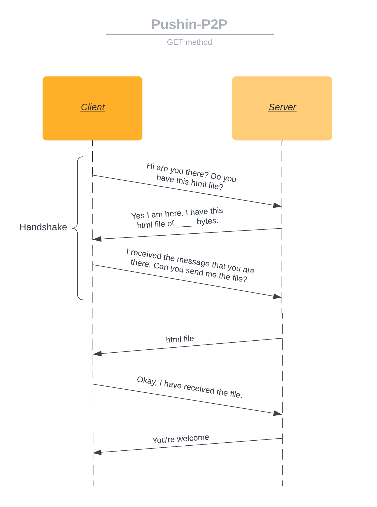
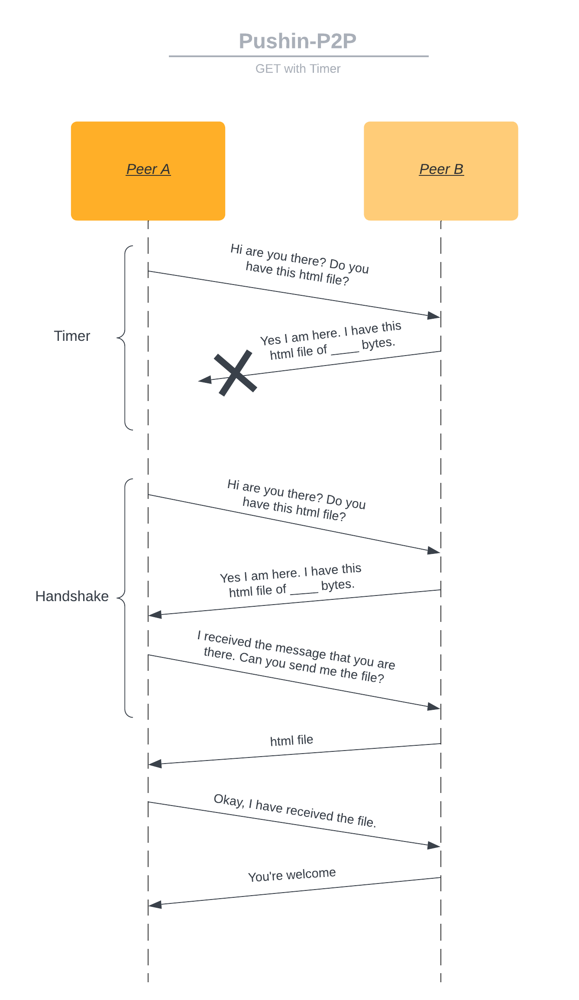
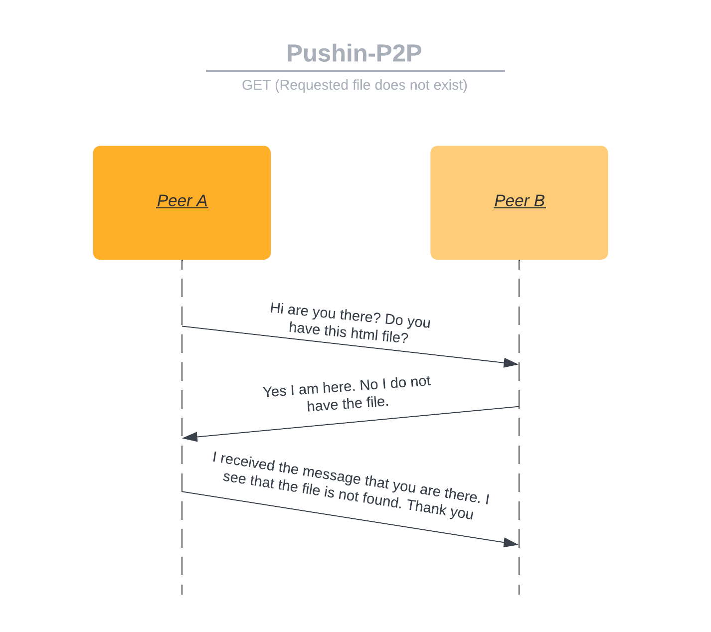
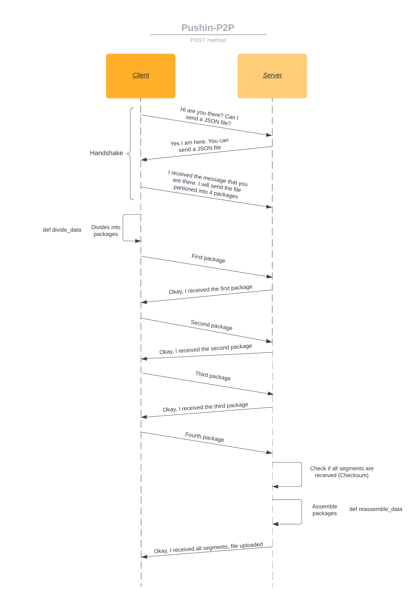
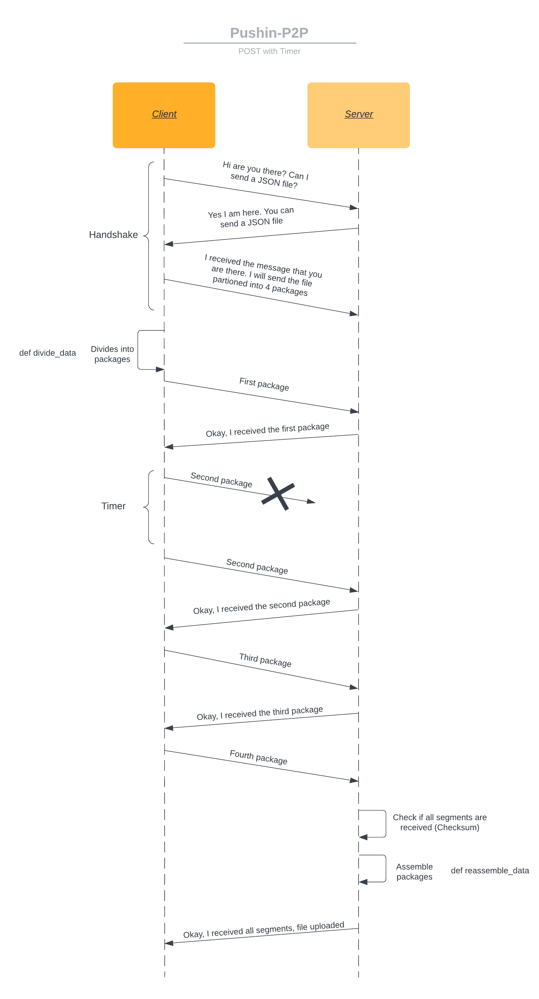

# pushin p2p

<h3 align="center">
Hi there, We're L4BC and this is our Computer Networks project</a> 👋
</h3>

## 📝 The purpose of pushin p2p is :

- Creating P2P Protocol on top of the UDP 
- Simulating packet loss of data
- HTTP-like operations such as GET and POST

## 💼 Language & Tools :


## Table of Contents
- [Features](#features)
- [Sequence Diagram](#sequence-diagram)
- [How the program works](#how-the-program-works)
- [Testing](#testing)
- [Contribute](#contribute)

## Features

Although the P2P Protocol is created on top of a UDP, it will have features that are commonly observed in TCP. These features are described below.

- 3-Way Handshake

  Positive Acknowledgement with Retransmission (PAR), specifically SYN-ACK signals, will be used to establish a connection between peers. Using a 3-way handshake to establish a connection increases the reliability of protocol communication.

- Dynamic Memory Flow

  The memory of data transmissions will be changed dynamically. This allows a more extensive variety of bytes to be used in transmissions. The bytes are not limited by a fixed number stated in the code beforehand.

- Packet Loss Control

  In order to prevent packet loss, a timer will be used alongside ACK and NAK signals. This ensures that packets are properly received or retransmitted if necessary. This will be further demonstrated in the Sequence Diagram.
  
TCP features are used in this protocol to improve the reliability of its communication. UDP is said to be an unreliable protocol due to its lack of guarantee in the arrival of the data. Hence, a number of features that are observed in TCP have been implemented in this protocol to prevent that unreliability. 

## How the program works

The program consists of two main parts; the P2P protocol and the operations.

### P2P Protocol
The P2P protocol is responsible for establishing a connection between two devices and transmitting data between them. The protocol implemented in this program is built on top of UDP to ensure fast and reliable data transmission. With the use of socket programming, each peer has a socket that listens for incoming connections and sends data to the other peer. 

The basic flow of the P2P protocol is as follows:
- Initialization: When a user selects a method (GET, POST, or default) the program creates a new socket and sends a request to the target peer, identified by its IP address and port number. UDP socket and port number bind
- The target peer receives the request and processes it according to the selected method.
- Once the data is received by the requesting peer, it is displayed on the console.

The program uses Python Socket and Multiprocessing libraries to handle incoming and outgoing connections within a single file.

### GET and POST functions

- GET: The target peer reads the requested HTML file from its storage medium and sends it back to the requesting peer
- POST: The target peer stores the received JSON file in its storage medium and sends and acknowledgment message back to the requesting peer

## Sequence Diagram

Note that the labels used in the diagrams below are *CLIENT* and *SERVER*. However, the protocol is still **PEER TO PEER**.

The terms *CLIENT* and *SERVER* are only used to display which **PEER** is on the recieving and sending end more clearly.

### GET Method
a) Successful Process


b) Failed Handshake (Use of Timer to prevent Package Loss)


c) Failed Response


d) Requested File Doesn't Exist


### POST Method
a) Successful Process


b) Failed Package


## Testing

### Requirements
- Python 3.x installed
- Two machines (or VMs) with different IP addresses (can be obtained using the `ifcongif`/`ipconfig` command).

In order to test the protocol, two end-systems are needed. This can be done in the form of multiple VMs or two operating systems for both receiving and sending files.

### Installing
#### via Git
1. Initialize Git
```bash
git init
```
2. Clone the repository in both machines:
```bash
git clone https://github.com/JugBones/Pushin-P2P.git
```
4. Navigate folder
```bash
cd Pushin-P2P
```

3. Install requirements
```bash
pip install -r requirements.txt
```
4. Run program
```bash
python main.py
```

#### via Github Desktop
1. Open Github Desktop
2. Clone repository using URL (https://github.com/JugBones/Pushin-P2P) & select the local path folder
3. Click the 'Clone' button

#### via ZIP
1. Click the green button with the text "Code"
2. Click the most bottom option "Download ZIP"
3. Save the ZIP file
4. Extract the ZIP file


## Demonstration/Tutorial
In order to get better understanding of this project, we provide the video demonstration of the project in this following link :

- Youtube link : https://youtu.be/HQVNWaDH8xk
- Google drive link : https://drive.google.com/file/d/1MAV0PHndABRyvDZYDPRxzwo_7k_PrytL/view?usp=sharing

Enjoy and happy learning !

## Contribute
We welcome contributions from the community to help improve our project and expand its capabilities!

If you want to report a bug, feel free to [create an issue](https://github.com/JugBones/Pushin-P2P/issues) in this repository.

If you have an idea or feature you'd like to contribute, please submit a pull request to the repository. The safest way is to create your own fork:
```bash
# clone this repository fork
git clone https://github.com/<your_name>/Pushin-P2P
```
Commit changes to your own branch and push to your fork. Then finally, submit a [pull request](https://github.com/JugBones/Pushin-P2P/pulls) so that we can review your changes and eventually integrate it in the project.

NOTE: Be sure to merge the latest from "upstream" before making a pull request!
